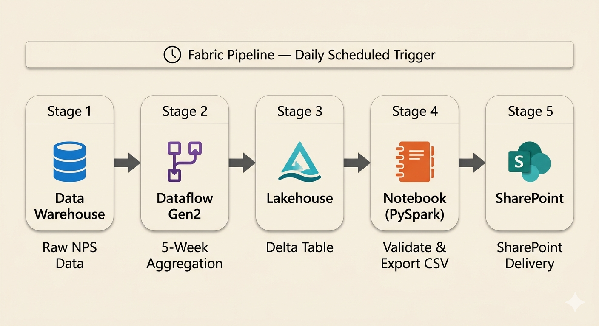
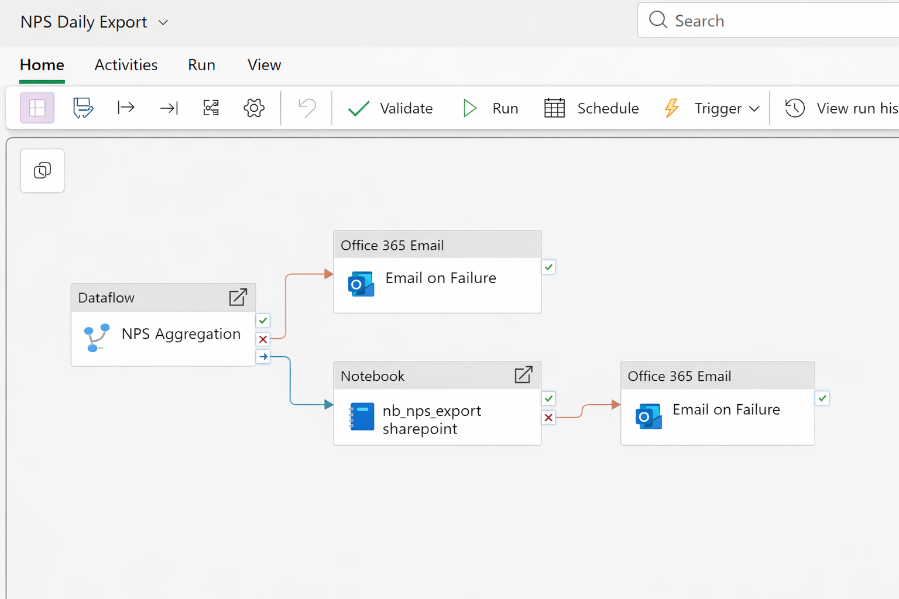

# Fabric NPS Rolling Pipeline

A production-grade Microsoft Fabric pipeline that automates the daily export of
a 5-week rolling NPS (Net Promoter Score) aggregation to SharePoint. The pipeline
replaces a manual weekly extraction process with a fully automated, idempotent,
and auditable daily job covering multiple brands, regions, touchpoints, and vehicle
segments across a global customer experience program.

---

## Problem Statement

Customer experience teams needed a daily refresh of NPS survey data aggregated
across the last 5 ISO weeks, broken down by 10 business dimensions (region, country,
brand, vehicle type, engine type, model, touchpoint, answer bucket). Previously,
this was produced manually — a weekly export that was error-prone, always a week
stale, and dependent on a specific person to run it.

**This pipeline eliminates the manual step** by running automatically every day,
validating the output before delivery, and uploading a stable-filename CSV to
SharePoint that downstream consumers (reports, dashboards) can reference without
configuration changes.

---

## Architecture Overview



Three logical layers, each with a single responsibility:

| Layer | Component | Technology |
|---|---|---|
| Ingestion | Raw survey data | Fabric Data Warehouse |
| Transformation | Aggregation logic | Dataflow Gen2 (Power Query / M Language) |
| Export | CSV delivery | PySpark Notebook + Microsoft Graph API |

The Fabric Pipeline enforces the execution order: the export notebook only runs
after the aggregation dataflow completes successfully.



See [docs/architecture.md](docs/architecture.md) for a full text description of
both diagrams.

---

## Data Flow

1. **Source read**: The Dataflow connects to a Fabric Data Warehouse and reads
   raw NPS survey responses from the `surveys_nps` table.

2. **Rolling window filter**: A 5-week ISO window is computed relative to the
   run date. The window always starts on a Monday; the Monday-vs-not-Monday
   branch (see [Key Engineering Decisions](#key-engineering-decisions)) ensures
   exactly 5 complete weeks are covered.

3. **Business transformations**: Field validation (vehicle type, engine type),
   brand code extraction, scope mapping (SALES → NV, POST-SALES → PS,
   REPAIR → RP), model name cleaning, and region normalization are applied.

4. **NPS bucketing**: Raw scores (0–10) are classified into three standard NPS
   categories: Detractors (1–6), Passives (7–8), Promoters (9–10).

5. **ISO week labeling**: Each row receives a `PERIOD` value in `YYYYWW` format
   using the ISO 8601 Thursday rule for correct year assignment at year boundaries.

6. **Aggregation**: All rows are grouped by the 10-column composite key and
   counted. The result is written to a Lakehouse Delta table (`cx_nps_rolling_5w`).

7. **CSV export**: The Spark Notebook reads the Delta table, validates the row
   count, and serializes the data to two CSV files: a date-stamped archive and
   a stable `LATEST` snapshot.

8. **SharePoint delivery**: Both CSV files are uploaded to SharePoint via the
   Microsoft Graph API using OAuth2 client credentials authentication.

---

## Tech Stack

| Component | Technology |
|---|---|
| Platform | Microsoft Fabric |
| Transformation | Dataflow Gen2 (Power Query / M Language) |
| Processing | PySpark (Fabric Spark runtime) |
| Storage | Fabric Lakehouse (Delta format) |
| Export destination | SharePoint via Microsoft Graph API |
| Authentication | OAuth 2.0 client credentials (AAD App Registration) |
| Orchestration | Fabric Pipeline (daily scheduled trigger) |
| Local dependencies | `pandas`, `requests` (see `requirements.txt`) |

---

## Key Engineering Decisions

### 1. ISO Week Thursday Rule

The `PERIOD` column uses ISO 8601 week numbering, where the year is determined
by the year that contains the **Thursday** of that week. The expression
`Date.AddDays(d, 4 - Date.DayOfWeek(d, Day.Monday))` shifts any date to its
week's Thursday before extracting the year. Without this, dates in the last days
of December or first days of January would be assigned to the wrong year
(e.g. December 30, 2024 belongs to ISO week 1 of **2025**, not 2024).

### 2. Monday-vs-Not-Monday Window Branch

The 5-week rolling window uses different offsets depending on whether the run
date is a Monday:

- **Monday**: go back 5 weeks from the current Monday (current week just started)
- **Tuesday–Sunday**: go back 4 weeks (current partial week is included)

This ensures the report always covers exactly 5 ISO weeks of data as of the
most recent completed Monday, regardless of when the pipeline runs.

### 3. Idempotent Full Re-Aggregation

Rather than computing counts incrementally, the entire 5-week window is
re-aggregated from raw data on every run. The `GROUP BY` across all 10 dimensions
is both the deduplication mechanism and the idempotency guarantee: re-running
the pipeline on the same day, or retrying after a failure, always produces the
same output. There is no mutable state to manage.

### 4. Dual CSV Output Pattern

Two files are written on every successful run:

- `nps_rolling_5w_YYYYMMDD.csv` — dated archive for audit and point-in-time recovery
- `nps_rolling_5w_LATEST.csv` — stable filename for downstream consumers

This decouples consumers (a Power BI report, a stakeholder's bookmark) from the
pipeline schedule. Consumers reference `LATEST` and always get the most recent
data without any configuration change.

### 5. Fail-Fast on Empty Table

Before generating any CSV, the notebook checks `row_count == 0` and raises an
exception if the table is empty. This prevents uploading a blank file that would
silently overwrite the last good export in SharePoint — a subtle but important
data quality guard.

---

## Repository Structure

```
fabric-nps-rolling-pipeline/
├── README.md                          # This file
├── .gitignore
├── .env.example                       # Environment variable template
├── requirements.txt
│
├── notebooks/
│   └── nb_nps_export_sharepoint.ipynb # PySpark notebook: Delta → CSV → SharePoint
│
├── dataflow/
│   ├── dataflow_logic.md              # Annotated Power Query (M Language) code
│   └── dataflow_schema.json           # Source and output schema as structured JSON
│
├── pipeline/
│   └── pipeline_description.md        # DAG, activity config, retry/failure behavior
│
├── config/
│   └── config_template.py             # All env-var references, zero secrets
│
├── sample_data/
│   ├── sample_output.csv              # 30 synthetic rows matching the output schema
│   └── data_dictionary.md             # Column specs, region codes, PERIOD format
│
└── docs/
    ├── architecture.md                # Text description of the architecture diagrams
    ├── fabric_artifacts_logic.png     # Component and data flow diagram
    └── pipeline_dag.png               # Pipeline DAG visualization
```

---

## Configuration

All secrets and environment-specific values are read from environment variables.
No credentials appear in any file in this repository.

Copy `.env.example` to `.env` and populate the values before running locally.
In Microsoft Fabric, set these as workspace environment parameters or via
Azure Key Vault.

| Variable | Description |
|---|---|
| `NPS_TABLE_NAME` | Delta table name in the Lakehouse (default: `cx_nps_rolling_5w`) |
| `LOCAL_EXPORT_FOLDER` | Lakehouse staging path for CSV files |
| `AAD_TENANT_ID` | Azure AD Directory (tenant) ID |
| `AAD_CLIENT_ID` | Azure AD Application (client) ID |
| `AAD_CLIENT_SECRET` | Azure AD client secret value |
| `SPO_SITE_PATH` | SharePoint site path for Graph API resolution |
| `SPO_FOLDER_PATH` | Target folder within the SharePoint drive |
| `SPO_SITE_ID` | Graph API site ID |
| `SPO_DRIVE_ID` | Graph API drive ID |

See [config/config_template.py](config/config_template.py) for instructions on
where to find each value in the Azure Portal.

---

## Adapting to Your Workspace

1. Set all environment variables from `.env.example`
2. In Fabric, attach `nb_nps_export_sharepoint.ipynb` to your Lakehouse
3. Update the Dataflow source to point to your Data Warehouse endpoint
4. Register an Azure AD app with `Files.ReadWrite.All` permission (admin-consented)
5. Update `SPO_SITE_ID` and `SPO_DRIVE_ID` using Graph Explorer:
   - `GET https://graph.microsoft.com/v1.0/sites/{SPO_SITE_PATH}`
   - `GET https://graph.microsoft.com/v1.0/sites/{site-id}/drives`
6. Add the Dataflow and Notebook as sequential activities in a Fabric Pipeline
7. Configure a daily scheduled trigger on the Pipeline

---

## Potential Improvements

- **Managed Identity**: Replace the AAD app registration (client credentials) with
  a Fabric workspace Managed Identity to eliminate secret rotation overhead
- **Retry with backoff**: Add client-side retry logic on the Graph API upload using
  `tenacity` to handle transient throttling before the pipeline marks the run failed
- **Parameterized window**: Expose the 5-week rolling window as a Pipeline parameter
  to enable ad-hoc historical extracts without code changes
- **Data quality assertions**: Add row count thresholds and null-rate checks before
  export to catch upstream data quality issues early
- **Failure notifications**: Configure a Fabric Pipeline failure activity to send
  an email alert when either activity fails
- **Resumable upload**: For datasets that grow beyond ~4 MB, replace the `PUT`
  upload with the Graph API resumable upload session
